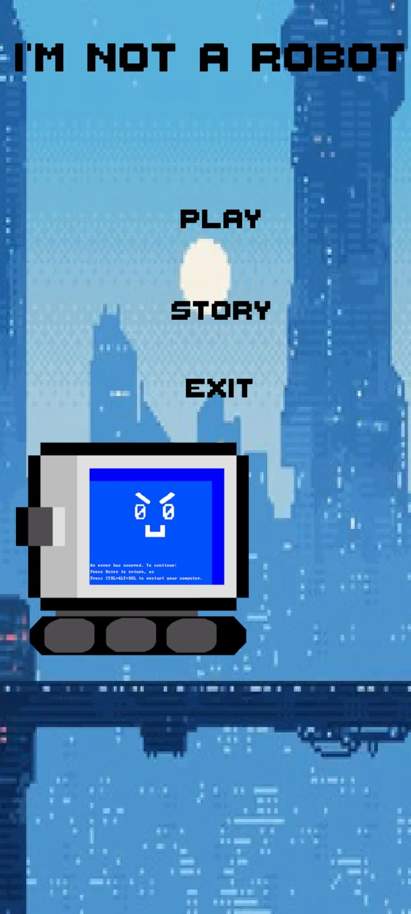
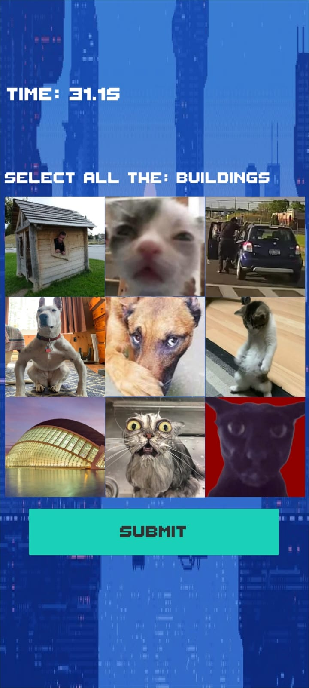
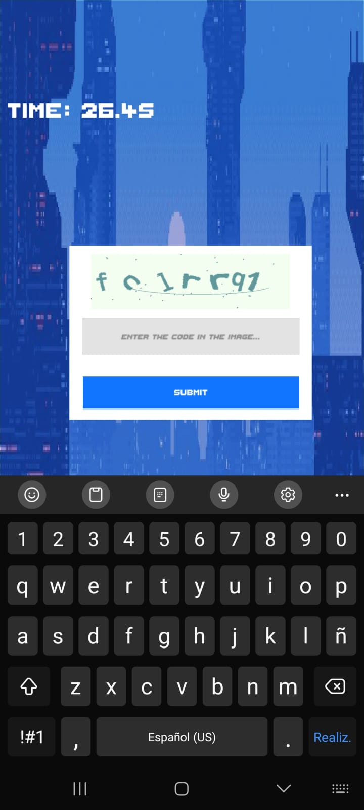
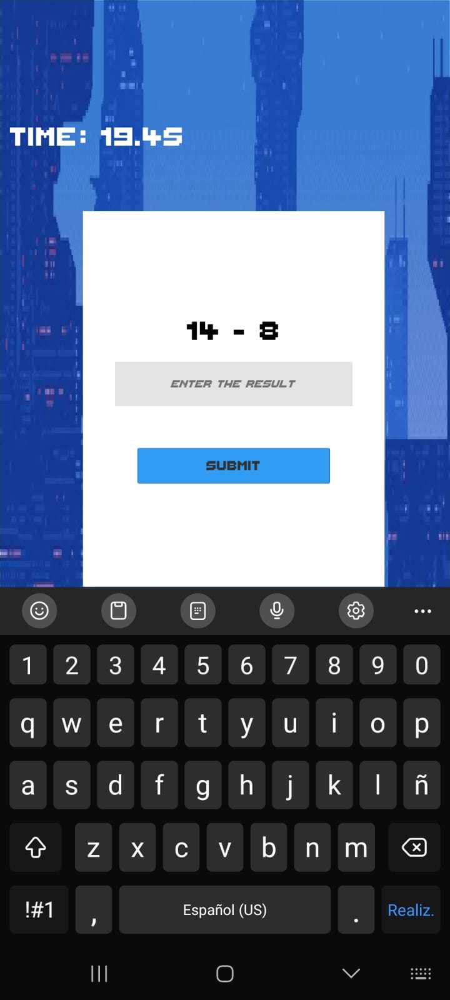

# Im-not-a-Robot
Im not a Robot fue desarrollado para el ramo "Desarrollo de juegos para dispositivos móviles" de la Universidad de Concepción.

El juego trata de superar la mayor cantidad de Captchas antes de que se acabe el tiempo. Dentro del juego hay Captchas de reconociemiento de imágenes, transcripción de imagen a texto y sumas/restas simples. Con estas mecánicas, el juego se centra en "Una colección de minijuegos en cortos periodos de tiempo".

    

El proyecto fue desarrollado para dispositivo con pantalla 1920x1080p, y testeado en un Samnsung Galaxy A52s, por lo que no es responsivo a otras relaciones de aspecto y no se puede asegurar que lo sea en celulares diferentes al usado en los test.

Si se desea probar el proyecto, descargar el .apk presente en el repositorio.

El proyecto fue desarrollado por Luciano Argomedo.
